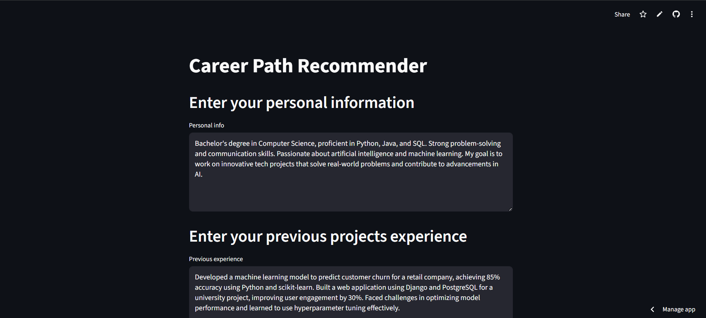

# 🤖 AI Career Coach

An intelligent career guidance application powered by Google's Gemini AI that helps professionals discover their optimal career path based on their skills, experience, and aspirations. The application uses advanced natural language processing to analyze user inputs and provide personalized career recommendations.

---

## 🚀 Features

### Core Functionality

* **Personalized Career Analysis**: AI-powered analysis of your skills, experience, and career goals
* **Multiple Career Path Evaluation**: Compare and evaluate multiple career options simultaneously
* **Intelligent Recommendations**: Data-driven suggestions based on your professional profile
* **Interactive Dashboard**: Clean, user-friendly interface built with Streamlit
* **Real-time Processing**: Instant career recommendations with retry logic for API limits

### Advanced Capabilities

* **Comprehensive Input Analysis**: Considers personal information, project experience, and career preferences
* **Structured Output**: Organized results with career rankings and confidence percentages
* **Error Handling**: Robust error handling with quota management and fallback options
* **Model Flexibility**: Support for multiple Gemini AI models with automatic fallback

---

## 🖥️ Screenshots

### Input Interface




### Career Recommendation Results


---

## ⚙️ Tech Stack

* **Frontend:** Streamlit
* **AI/ML Framework:** LangChain
* **AI Model:** Google Gemini 1.5 Flash
* **Data Processing:** Pandas
* **Data Validation:** Pydantic
* **Environment Management:** Python-dotenv
* **API Integration:** Google Generative AI

---

## 📋 Prerequisites

* Python 3.8 or higher
* Google AI API key
* Git

---

## 🚀 Installation

1. **Clone the repository**

   ```bash
   git clone <repository-url>
   cd AI-Career-Coach
   ```
2. **Create a virtual environment** (recommended)

   ```bash
   python -m venv venv
   source venv/bin/activate  # On Windows: venv\Scripts\activate
   ```
3. **Install dependencies**

   ```bash
   pip install -r requirements.txt
   ```
4. **Set up environment variables**

   - Create a `.env` file in the root directory
   - Add your Google AI API key:
     ```
     GOOGLE_API_KEY=your_api_key_here
     ```

---

## 🎯 Usage

1. **Start the application**

   ```bash
   streamlit run main.py
   ```
2. **Access the application**

   - Open your browser and navigate to `http://localhost:8501`
3. **Fill out the form**

   - Enter your personal information (skills, education, certifications, goals)
   - Describe your previous projects and experiences
   - List your desired career paths with descriptions
4. **Get recommendations**

   - Click "Get Recommendation" to receive AI-powered career suggestions
   - View results in an organized table format with rankings

---

## 🔧 Configuration

### API Setup

1. Get your Google AI API key from [Google AI Studio](https://makersuite.google.com/app/apikey)
2. Add it to your `.env` file as `GOOGLE_API_KEY`
3. Enable billing if you plan to use the application extensively

### Model Selection

The application supports multiple Gemini models:

- `gemini-1.5-flash` (default) - Fast and cost-effective
- `gemini-2.5-pro` - More advanced reasoning capabilities
- `gemini-2.5-flash` - Latest optimized model

### Quota Management

The application includes built-in quota management with:

- Automatic retry logic with exponential backoff
- Clear error messages for quota exceeded scenarios
- Suggestions for alternative models

---

## 📊 Data Flow

1. **User Input** → Personal info, experience, and career preferences
2. **AI Processing** → LangChain orchestration with Gemini AI
3. **Analysis** → Career path evaluation and ranking
4. **Output** → Structured recommendations with confidence scores
5. **Display** → Interactive results table in Streamlit

---

## 🛠️ Development

### Project Structure

```
AI-Career-Coach/
├── main.py              # Main application file
├── requirements.txt     # Python dependencies
├── .env                 # Environment variables (create this)
├── .gitignore          # Git ignore rules
└── README.md           # This file
```

### Key Components

- **Streamlit Interface**: Interactive web application
- **LangChain Integration**: AI model orchestration
- **Pydantic Models**: Data validation and parsing
- **Error Handling**: Robust API interaction management

---

## 🔍 Troubleshooting

### Common Issues

**"GOOGLE_API_KEY not found"**

- Ensure you have created a `.env` file
- Check that your API key is correctly entered
- Verify the API key is active in Google AI Studio

**"Quota exceeded"**

- Enable billing on your Google Cloud project
- Request a quota increase
- Try switching to a different model
- Wait for quota reset (usually 24 hours)

**"No valid recommendations received"**

- Ensure all input fields are filled with sufficient detail
- Check your internet connection
- Verify the API key has proper permissions

### Getting Help

- Check the browser console for detailed error messages
- Review the Streamlit logs in the terminal
- Ensure all dependencies are properly installed

---

## 📈 Performance Tips

* **Detailed Input**: Provide comprehensive information for better recommendations
* **Clear Career Paths**: Structure career options with clear names and descriptions
* **Model Selection**: Use `gemini-2.5-pro` for complex career analysis
* **Quota Monitoring**: Monitor your API usage in Google Cloud Console

---

## 🤝 Contributing

1. Fork the repository
2. Create a feature branch (`git checkout -b feature/amazing-feature`)
3. Commit your changes (`git commit -m 'Add amazing feature'`)
4. Push to the branch (`git push origin feature/amazing-feature`)
5. Open a Pull Request

---

## 📄 License

This project is licensed under the MIT License - see the [LICENSE](LICENSE) file for details.

---

## 🙏 Acknowledgments

* **Google AI** for the Gemini API
* **LangChain** for the AI orchestration framework
* **Streamlit** for the web application framework
* **Open Source Community** for various tools and libraries

---

## 📞 Support

For support and questions:

- Create an issue in the repository
- Check the troubleshooting section above
- Review the Google AI documentation for API-related issues

---

## 🔮 Future Enhancements

* **Industry-specific recommendations** for specialized fields
* **Salary and market trend analysis** integration
* **Resume parsing** for automatic skill extraction
* **Interview preparation** modules
* **Career progression tracking** over time
* **Multi-language support** for global users

---

**Ready to discover your next career move? 🚀**
